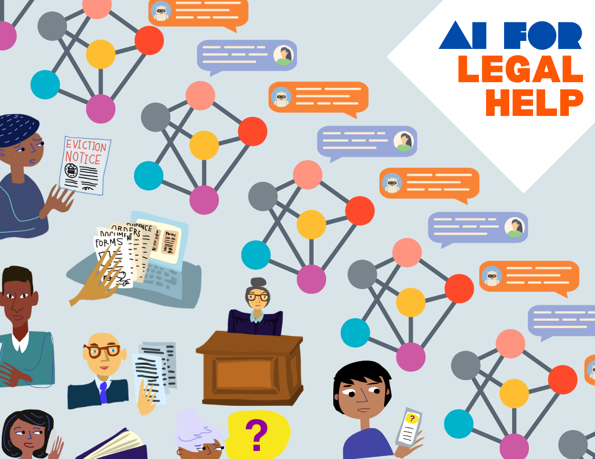

# Common Law Assistant




## Introduction

**Common Law Assistant** is a RAG (Retrieval-Augmented Generation) application that leverages **Llama3.2** to provide accurate and context-aware answers to legal questions. It helps users interpret legal texts, understand laws, and gain insights into legal principles efficiently.  

The overall goal is to provide a cheap, and ready to use Legal Assistant, that can help people assess their legal positions, without the hassle of hefty legal fees.


## Prerequisites

Before setting up the environment, install Ollama by following the instructions from the official website:  
[Ollama](https://ollama.com/)

## Set Up Environment

```sh
ollama pull nomic-embed-text
python -m venv .venv
source .venv/bin/activate
python -m pip install ollama numpy
```
## System
I am using Intel i7-14700H with 16GB of RAM. The model takes ~7 seconds for each question to answer on my machine.

## Output

I asked some questions which involved different scenarios testing the legal procedure, in increading order of text complexity and details. 
As seen in the output snippets, the model provides a cohesive answer based on the context and prompt. But currently, it does not apply "I don't know" explicitly, and provides a mixed answer.

I have provided an extended snippet of text conversation with the model in ```cl_asst.txt```

## Contribution
I am not very savvy in the legal langauge. Any help in understanding and simplifying the same is sought after and greatly appreciated.
